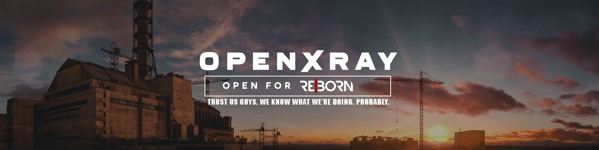

  

    
  

<h1 align="center">
  OpenXRay: Reborn Fork
</h1>

**OpenXRay** is an improved version of the X-Ray Engine, the game engine used in the world-famous S.T.A.L.K.E.R. game series by GSC Game World.

**OXR RE|Born** is a fork of the OpenXRay engine to add a few features for our revision of Call of Chernobyl.

This is the engine fork repository, for the main gamedata repo check here: https://github.com/Sermegshimin/RE-BORN-MAIN   

## Goals
1. Incorporate additional features as required by our revision of CoC, including features ported from other X-Ray engine branches
2. Retain development parity with the vanilla OpenXRay engine. That means we try to not fall behind their development progress by continually pulling their changes.

## Contributing
All contributions are more than welcomed. Join our Discord if you have any experience in Stalker modding - there's a lot of work to be done, and we could always use a hand :)

### Community
[Discord](https://discord.gg/8uteTKKEKp)

If you have any issues, speak to us on the Discord. Do not bother the OpenXRay developers unless you have made sure the bug appears in the [vanilla](https://github.com/OpenXRay/xray-16) version of the engine.

### Funding
Below are links to support the vanilla OpenXRay engine - Please support them, they are the beating heart that keeps the original S.T.A.L.K.E.R. alive!
  

You may provide financial support for this project by donating via different ways:
* [Boosty](https://boosty.to/openxray) – a large part of the team is located in Russia, if you have an ability to donate through Boosty, please use it, since we don't have an ability to withdraw funds from services like Patreon, etc. to our local Russian banking cards/accounts.
* [GitHub Sponsors](https://github.com/sponsors/OpenXRay), [Patreon](https://patreon.com/openxray), [Open Collective](https://opencollective.com/openxray) – funds raised from these services will be used to support our developers outside of Russia, and also we may use them to pay for paid services on GitHub, AppVeyor, etc.
* BTC: 363ZUoWcQe9fDvRPK9Kee2YuPdyhSFQpr2
* ETH: 0x45a4fe8566e76946591e1eeabf190aa09b1cdb66
* TRX: TGx7QAhTPsRcwnb4mwCtNDU7NF6kuoACpt
* Please, contact @xottab_duty in [our Discord](discord.gg/sjRMQwv) if you would like to use another cryptocurrency.

Thank you for your support!

## Thanks
* [GSC Game World](https://gsc-game.com/) – for creating S.T.A.L.K.E.R. and supporting the community;
* Loxotron – for making the engine sources available;
* [All the OpenXRay contributors](https://github.com/OpenXRay/xray-16/graphs/contributors) – for making the project better.
  * The first OpenXRay team (2014-2017) – for being at the origins of the project.
    * [nitrocaster](https://github.com/nitrocaster) – original project founder.
    * [Kaffeine](https://github.com/Kaffeine) – initial work on the Linux port, refactoring, polishing.
    * [CrossVR](https://github.com/CrossVR) (Armada651) – creation of the OpenGL renderer, work on the build system, other project maintenance work.
    * [andrew-boyarshin](https://github.com/andrew-boyarshin) – work on the build system.
    * [CasualDev242](https://github.com/CasualDev242) (Swartz27) – work on renderer features.
    * [awdavies](https://github.com/awdavies) – project maintenance work.
  * The second OpenXRay team (2017-now) – for continuing work on the project.
    * [Xottab_DUTY](https://github.com/Xottab-DUTY) – current project leader.
    * [intorr](https://github.com/intorr) – work on the project quality. (memory leaks, refactoring, optimizations)
    * [eagleivg](https://github.com/eagleivg) – main part of the work on Linux port.
    * [q4a](https://github.com/q4a) – main part of the work on Linux port.
    * [SkyLoader](https://github.com/SkyLoaderr) – OpenGL renderer improvements and polishing, other project work.
    * [qweasdd136963](https://github.com/qweasdd136963) – supporting the [OXR_COC](https://github.com/qweasdd136963/OXR_CoC) project (Call of Chernobyl port to latest OpenXRay), other project work on new features, refactoring and bug fixing.
    * JohnDoe_71Rus – our regular tester.
    * [Chip_exe](https://github.com/007exe) – work on Linux port, maintaining AUR package, our regular tester.
    * [a1batross](https://github.com/a1batross) – work on Linux port.
    * [The Sin!](https://github.com/FreeZoneMods) – new features, refactoring, bug fixing polishing.
    * [Zegeri](https://github.com/Zegeri) – work on Linux port, code quality, fixes, polishing.
    * [drug007](https://github.com/drug007) – work on Linux port.
    * [vTurbine](https://github.com/vTurbine) – work on renderer unification, refactoring, polishing.
    * [Zigatun](https://github.com/Zigatun) – work on ARM port.
    * [Masterkatze](https://github.com/Masterkatze) – work on the build system, bug fixing.
    * [Chugunov Roman](https://github.com/ChugunovRoman) – work on [porting Call of Chernobyl to latest OpenXRay](https://github.com/ChugunovRoman/xray-16), extending functionality for modmakers.
    * [yohjimane](https://github.com/yohjimane) – work on original game bugs fixes and new features.
  * Other contributors:
    * [alexgdi](https://github.com/alexgdi) – work on organizing project infrastructure, external dependencies.
    * [NeoAnomaly](https://github.com/NeoAnomaly) – help with debug functionality on Windows.
    * [RainbowZerg](https://github.com/RainbowZerg) – work on the renderer features, bug fixing.
    * [FozeSt](https://github.com/FozeSt) – help with some fixes and features.
    * [justtails](https://github.com/justtails) (mrnotbadguy) – work on gamepads support and bug fixing.
    * [devnexen](https://github.com/devnexen) – work on FreeBSD support and portability.
    * [vamit611](https://github.com/vamit611) – work on code quality and bug fixes.
    * [ZeeWanderer](https://github.com/ZeeWanderer) – work on the build system.
    * [GeorgeIvlev](https://github.com/GeorgeIvlev) – work on the build system, bug fixing.
    * [r-a-sattarov](https://github.com/r-a-sattarov) – work on portability and E2K support.
    * [TmLev](https://github.com/TmLev) – work on code quality and Docker support.
    * [Plotja](https://github.com/Plotja) – work on new gameplay features, bug fixes, portability, polishing.
    * [jjdredd](https://github.com/jjdredd) – work on various useful features.
    * [dimhotepus](https://github.com/dimhotepus) – work on code quality.
    * [HeapRaid](https://github.com/HeapRaid) – work on renderer cleanup, code quality, portability.
    * [OPNA2608](https://github.com/OPNA2608) – maintaining NixOS package, work on portability.
    * [kosumosu](https://github.com/kosumosu) – work on portability, including E2K support, and renderer features.
    * [Graff46](https://github.com/Graff46) – work on various scripting features.
    * [vertver](https://github.com/vertver) – work on macOS support.
    * [Lnd-stoL](https://github.com/Lnd-stoL) – work on macOS support.
    * [GermanAizek](https://github.com/GermanAizek) – work on code quality, finding and fixing vanilla bugs.
    * [dasehak](https://github.com/dasehak) – work on FreeBSD support, finding and fixing vanilla bugs.
    * [Hrust](https://github.com/Hrusteckiy) – work various features, including UI, CS/SOC support and bug fixes.
    * [johncurley](https://github.com/johncurley) – work on EFX, bugs and portability.
    * [v2v3v4](https://github.com/v2v3v4) – work on physics, useful help with the engine and showing sexy screenshots and videos about his X-Ray fork, but refusing to send pull requests :D
    * [Neloreck](https://github.com/Neloreck) – work on extending Lua scripting features.
    * [sobkas](https://github.com/sobkas) – work on code quality and bug fixing.
    * [AMS21](https://github.com/AMS21) – work on CMake, code quality, and project standards and infrastructure.
    * [olefirenque](https://github.com/olefirenque) – work on multithreading and code optimization.
    * [tsmp](https://github.com/tsmp) – work on performance and code optimization.
* Particular projects:
  * [Oxygen](https://github.com/xrOxygen) – for being our friends and giving tips and help with new features, optimizations, bug fixes, etc.
  * [Shoker Weapon Mod](https://github.com/ShokerStlk/xray-16-SWM) and [Shoker](https://github.com/ShokerStlk) – for contributing new features, bug fixing.
  * [Im-Dex](https://github.com/Im-dex/xray-162) – for the work on the engine.
  * [OGSR](https://github.com/OGSR/OGSR-Engine) – for amazing work on Shadow of Chernobyl.
  * [Call of Chernobyl](https://github.com/revolucas/CoC-Xray) and its contributors – for useful new features, bug fixes and optimizations.
  * Lost Alpha – for their effort on restoring the old game concept.
  * Lost Alpha DC – for continuing work on Lost Alpha.
* Individuals:
  * [tamlin-mike](https://github.com/tamlin-mike) – for work on the build system.
  * [Vincent](https://github.com/0xBADEAFFE) – for work on the Linux port.
  * [abramcumner](https://github.com/abramcumner) – for useful fixes and additions.
  * [Morrey](https://github.com/morrey) – for work on Clear Sky support and his Return to Clear Sky mod.
* Companies:
  * [CoderGears](https://www.cppdepend.com) – thanks for providing a [free Pro Licence for CppDepend](https://www.cppdepend.com/cppdependfoross), an amazing and powerful tool for C and C++.  
    
  * [PVS-Studio LLC](https://pvs-studio.com/pvs-studio/?utm_source=website&utm_medium=github&utm_campaign=open_source) – thanks for proving us a [free licence](https://pvs-studio.ru/ru/order/open-source-license/?utm_source=website&utm_medium=github&utm_campaign=open_source) for PVS-Studio, a static analyzer for C, C++, C#, and Java code.

If your work is being used in our project and you are not mentioned here or in the [contributors page](https://github.com/OpenXRay/xray-16/graphs/contributors), please, write to us and we will add you. Or send us a pull request with you added to this list ;)
